# MedCore Decoupled Microservices Backend

This repository houses the microservices backend for the **MedCore** hospital management and forum application. The project is designed with scalability, high-maintainability, and decoupled domains in mind, moving away from a modular monolith to a distributed microservices pattern.

---

## Architecture Overview

MedCore is composed of isolated, containerized Django services orchestrating workflows asynchronously via Apache Kafka and cache-layering via Redis.

```mermaid
flowchart TD
    Client["Client / curl"] -->|Port 8000| Gateway["NGINX Gateway"]
    
    Gateway -->|/api/v1/auth/*| AdminAuth["admin_auth (Port 8001)"]
    Gateway -->|/api/v1/patients/*| PatientAuth["patient_auth (Port 8002)"]
    Gateway -->|/api/v1/profiles/*| Profiles["profiles (Port 8003)"]
    
    AdminAuth -->|Publish user_registered| Kafka["Apache Kafka (Port 9092)"]
    Profiles -->|Publish otp_generated| Kafka
    
    Kafka -->|Consume events| Notifications["notifications (Consumer Worker)"]
    
    Profiles <-->|Read / Write OTP| Redis["Redis Cache (Port 6379)"]
```



### Components:
1. **NGINX API Gateway (`gateway/`)**: Proxies incoming traffic on port `8000` to appropriate downstream microservices dynamically.
2. **Admin Auth Service (`services/admin_auth/`)**: Manages administrative roles, user registration, multi-device session tracking, device limits, and dynamic Role-Based Access Control (RBAC).
3. **Patient Auth Service (`services/patient_auth/`)**: Decoupled database and service handling registration, credentials check, and token generation for patients.
4. **Profiles Service (`services/profiles/`)**: Stores and fetches bio details, profile picture uploads, and handles Redis-backed multi-channel verification OTPs.
5. **Notifications Service (`services/notifications/`)**: Runs an asynchronous background consumer listening to Kafka topics and simulating communication delivery (Welcome Email, OTP SMS/Email).
6. **Apache Kafka + Zookeeper**: Event broker coordinating decoupled cross-service messaging.
7. **Redis**: Cache store for short-lived session structures and OTP storage.
8. **PostgreSQL**: Isolated, multi-database schema cluster (`medcore_admin_auth`, `medcore_patient_auth`, `medcore_profiles`, `medcore_notifications`).

---

## Directory Layout

```text
medcore_services/
├── docker-compose.yml            # Orchestration for Zookeeper, Kafka, Redis, DB, Gateway, and Services
├── requirements.txt              # Shared Python requirements
├── Endpoint.md                   # Endpoints and payload specifications reference
├── gateway/
│   ├── Dockerfile
│   ├── nginx.conf                # API Gateway reverse-proxy mappings
│   └── init-db.sh                # Postgres bootstrap schemas initialization
└── services/
    ├── admin_auth/               # Django Admin Auth microservice
    ├── patient_auth/             # Django Patient Auth microservice
    ├── profiles/                 # Django Profiles microservice
    └── notifications/            # Django Notifications Kafka worker
```

---

## Getting Started

### Prerequisites
- [Docker](https://www.docker.com/) and [Docker Compose](https://docs.docker.com/compose/)

### 1. Build and Run the Stack
To start all services, middleware components, and databases in detached mode:
```bash
docker-compose up --build -d
```

### 2. Apply Database Migrations
Run Django migrations inside the individual service containers to apply database schemas and seed default roles:
```bash
# Migrate Admin Auth & Seed Default Roles
docker-compose exec admin_auth python manage.py migrate

# Migrate Patient Auth
docker-compose exec patient_auth python manage.py migrate

# Migrate Profiles
docker-compose exec profiles python manage.py migrate
```

---

## Core Features

### Dynamic Role-Based Access Control (RBAC)
Roles are stored dynamically in the database instead of hardcoded choice tuples.
- **Seeded Default Roles**: `super_admin`, `admin`, `account_manager`, `accountant`, `department_manager`, `receptionist`, `staff`, `Doctor`.
- **Dynamic Creation**: Admins can define new roles on the fly using `POST /api/v1/auth/roles/create/`.
- **Bootstrap Mode**: The first user registering on an empty database bootstraps automatically as `super_admin` and gets verified.

### Session Device Enforcements
- Admins (`super_admin` and `admin` roles) are limited to $\le 4$ active concurrent device sessions. 
- Logging in a 5th time will return a `400 Bad Request` until one of the active sessions is revoked via `/api/v1/auth/sessions/logout-device/` or `/api/v1/auth/sessions/logout-all/`.

### Decoupled Kafka Event Delivery
When a user is created or an OTP is requested, the respective service dispatches a Kafka message. To watch the notifications consumer process these actions live:
```bash
docker logs -f medcore_notifications
```

---

## API Reference

For a complete list of endpoints, headers, JSON request payloads, and response structures, refer to the [Endpoint.md](Endpoint.md) reference.
